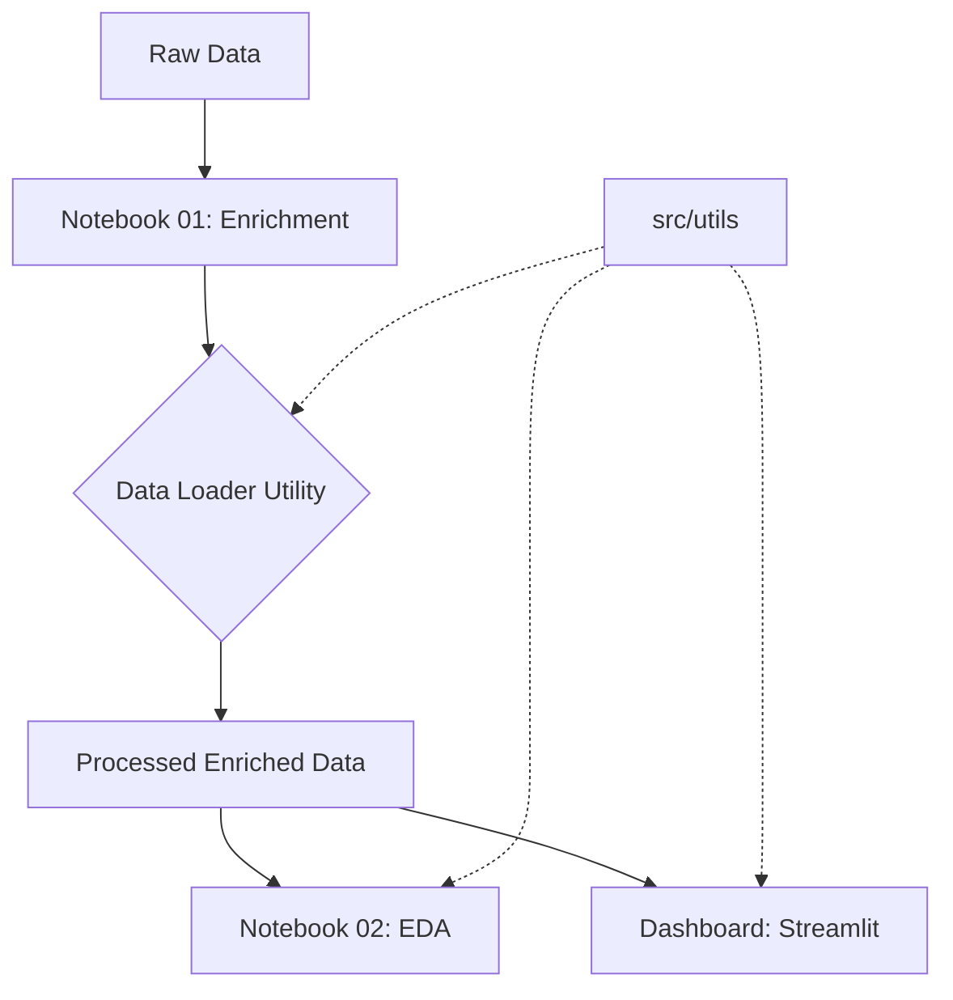

# Forecasting Financial Inclusion in Ethiopia


An end-to-end analytical framework designed to forecast financial inclusion trajectories in Ethiopia. This project integrates unified datasets, explicitly models policy-impact relationships, and provides a modular architecture for scalable time-series forecasting and policy simulation.

## 🚀 Key Features

- **Modular Design Pattern**: Centralized technical infrastructure in `src/` for data lifecycle management, visualization, and configuration.
- **Advanced Data Enrichment**: Integrates 2024 mobile money baselines and structural policy events (e.g., IMF Extended Credit Facility) into the unified dataset.
- **Explicit Causal Linkage**: Implements `parent_id`-based `impact_link` modeling to track the relationship between specific events (Telebirr/M-Pesa launches) and their quantitative impacts on digital inclusion.
- **Interactive EDA**: Deep-dive exploratory analysis powered by robust processing utilities.
- **Modular Dashboarding**: Real-time visualization of digital pillars via a Streamlit-based interface.
- **Automated Verification**: Integrated test suite for data transformations and loading logic.

---

## 🏗 System Architecture

The project follows a modular scientific computing structure to ensure reproducibility and maintainability.



- **`src/config.py`**: The single source of truth for filesystem paths and plotting aesthetics.
- **`src/utils/data_loader.py`**: High-level API for data ingestion, categorical normalization, and datetime alignment.
- **`src/utils/plotting.py`**: Domain-specific visualization wrappers for temporal coverage and distribution analysis.

---

## 📊 Data & Enrichment Pipeline

### 1. Unified Dataset Construction
The framework utilizes a long-format schema that accommodates diverse record types:
- **Observations**: Quantitative metrics (e.g., Total Mobile Money Accounts).
- **Events**: Qualitative policy changes or infrastructure launches.
- **Impact Links**: Explicit directional arrows connecting Events to Observations.

### 2. Strategic Enrichment
The baseline dataset has been programmatically enhanced in `notebooks/01_data_exploration_and_enrichment.ipynb` with:
- **2024 Benchmarks**: Estimates from National Bank of Ethiopia (NBE) reports.
- **Policy Drivers**: Significant events such as the IMF ECF approval and telecom liberalization mileposts.
- **Relational Integrity**: Linking `record_id` 14 (Telebirr Launch) to subsequent growth metrics via `parent_id` attributes.

---

## 🛠 Setup & Installation

### Prerequisites
- Python 3.9+
- Pip or Conda

### Installation
1. Clone the repository:
   ```bash
   git clone https://github.com/soltsega/Forecasting-Financial-Inclusion-in-Ethiopia.git
   cd Forecasting-Financial-Inclusion-in-Ethiopia
   ```
2. Install dependencies:
   ```bash
   pip install -r requirements.txt
   ```

---

## 📖 Usage

### Research & Analysis
Run the Jupyter Notebooks to regenerate processed data or explore trends:
- `notebooks/01_data_exploration_and_enrichment.ipynb`: Core enrichment engine.
- `notebooks/02_exploratory_data_analysis.ipynb`: Statistical exploration of digital inclusion pillars.

### Running the Dashboard
Launch the interactive visualization suite:
```bash
streamlit run dashboard/app.py
```

### Running Tests
Execute the verification suite:
```bash
pytest tests/
```

---

## 🗺 Roadmap
- [ ] **Task 3**: Advanced Time-Series Modeling (ARIMA/Prophet) utilizing enriched causal links.
- [ ] **Task 4**: Policy Simulation Engine to model "What-If" scenarios for telecom tax changes.
- [ ] **Task 5**: Automated weekly data ingestion from the NBE API.

---

## ⚖ License
Distributed under the MIT License. See `LICENSE` for more information.

---
**Author**: [Solomon T.](https://github.com/soltsega)
